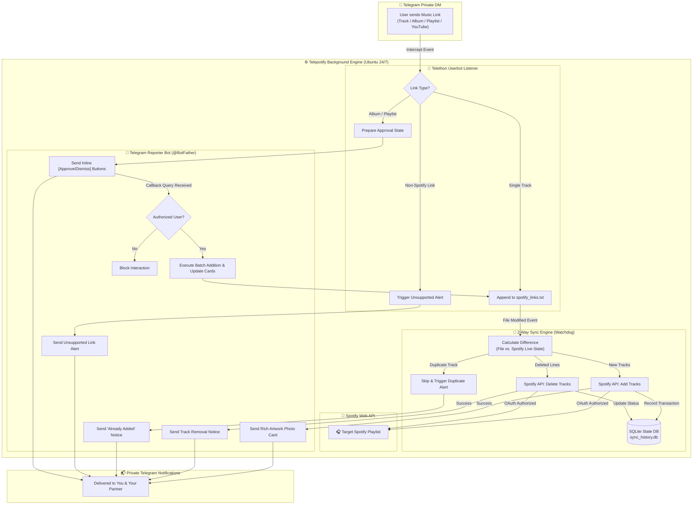

<div align="center">

# 🎧 Telepotify

**A robust 24/7 background synchronization service bridging Telegram chats with Spotify playlists.**

[](https://www.python.org/downloads/)
[](https://developer.spotify.com/)
[](https://docs.telethon.dev/)
[](https://opensource.org/licenses/MIT)
[](https://ubuntu.com/)

<p align="center">
  <a href="#-overview">Overview</a> •
  <a href="#-architecture">Architecture</a> •
  <a href="#-key-features">Features</a> •
  <a href="#-getting-started">Getting Started</a> •
  <a href="#-configuration-env">Configuration</a> •
  <a href="#-ubuntu-server-deployment">Server Deployment</a> •
  <a href="#-utility-scripts">Utilities</a> •
  <a href="#-faq--troubleshooting">FAQ</a>
</p>

</div>

---

## 🌟 Overview

Sharing music in direct messages often leads to lost recommendations and manually updating playlists. **Telepotify** solves this by running silently in the background on your server to keep your collaborative Spotify playlist perfectly in sync with your Telegram conversation.

Whenever you or your partner/friend share music in your private Telegram chat, **Telepotify**:
1. **Listens in real time** via a lightweight Telethon userbot.
2. **Appends the track** to a master 2-way sync source file (`spotify_links.txt`).
3. **Synchronizes directly with Spotify** using the Spotify Web API with strict deduplication.
4. **Dispatches rich notification cards** (Album Art, Track Title, Artist, Album Name, and Playlist Total) to both users via a dedicated Telegram bot.
5. **Presents interactive approval prompts** (`[✅ Add All]` / `[❌ Dismiss]`) when full Albums or external Playlists are sent.

---

## 🏗️ Architecture



---

## 🚀 Key Features

* **⚡ Real-Time Auto-Capture**: Intercepts Spotify links instantly from direct messages without requiring manual forward commands or tagging bots in the chat.
* **🔄 True 2-Way Bidirectional Synchronization**:
  * **Additions**: Adding links to `spotify_links.txt` automatically adds tracks to your Spotify playlist.
  * **Removals**: Deleting lines from `spotify_links.txt` immediately removes them from your Spotify playlist.
* **🤖 Interactive Dual-User Approval**: Sharing an Album or external Playlist generates an interactive inline keyboard card for both users. Either person can approve the collection, and both cards dynamically update in real time.
* **🖼️ Rich Track Photo Cards**: Delivers high-resolution album artwork, track title, artist name, album name, and the updated playlist count.
* **🛡️ Zero Duplication Guarantee**: Live playlist reconciliation and local SQLite indexing ensure duplicate songs are never re-added.
* **🌐 Modern Spotify API Schema Support**: Fully compatible with the latest Spotify Web API format (handling both modern `item` and legacy `track` response keys).
* **⚡ High-Resilience Networking**: Built-in 25-second API timeouts with automatic 3x exponential backoff retries to withstand temporary network latency.
* **⚠️ Non-Spotify Link Detection**: Automatically alerts users if Apple Music, YouTube, or SoundCloud links are shared so you know it wasn't added to Spotify.
* **🔒 Security Hardened**:
  * Telethon sessions and Spotify OAuth tokens are locked down with `0600` file permissions.
  * Bot tokens are automatically redacted from error logs.
  * Callback queries enforce strict Telegram user authorization checks.
* **⚙️ Production-Ready Systemd Daemon**: 1-click installer configured with process sandboxing, crash recovery, and auto-start on boot.

---

## 📂 Repository Structure

```text
telepotify/
├── .env.example                  # Fully documented environment variable template
├── .gitignore                    # Strict rules preventing leakage of keys/sessions/DBs
├── LICENSE                       # MIT License
├── README.md                     # Comprehensive documentation & deployment guide
├── requirements.txt              # Core Python dependencies
├── main.py                       # Master asynchronous orchestrator
├── telegram_listener.py          # Telethon chat listener userbot
├── telegram_reporter.py          # Telegram Bot API client & interactive button poller
├── file_watcher.py               # Watchdog 2-way sync file monitor & reconciliation engine
├── spotify_client.py             # Spotify Web API client with headless OAuth & retry engine
├── state_db.py                   # SQLite database manager for history and pending approvals
├── verify_setup.py               # Credentials & connection diagnostic test suite
├── auth_userbot.py               # Standalone Telethon interactive login utility
├── clean_duplicates.py           # 1-click Spotify playlist deduplicator & sanitizer
├── setup_systemd.sh              # 1-click systemd service installer for Ubuntu
├── spotify-sync.service.template # Hardened systemd service unit template
└── spotify_links.txt             # Master 2-way sync source file
```

---

## 🛠️ Getting Started

### 1. Prerequisites & API Credentials

Before deploying, collect your credentials:

#### A. Telegram Userbot (Listener)
1. Log in to [my.telegram.org](https://my.telegram.org) with your phone number.
2. Navigate to **API development tools** and create an application.
3. Copy **`API_ID`** and **`API_HASH`**.

#### B. Telegram Reporter Bot (Notifications)
1. Open Telegram and search for [@BotFather](https://t.me/BotFather).
2. Send `/newbot`, choose a name and username (e.g. `@my_music_sync_bot`).
3. Copy the **HTTP API Bot Token**.
4. **Important**: Both you and your partner must open your new bot and click **Start** (`/start`) once so the bot has permission to message you.
5. Get your numeric Telegram user IDs using [@userinfobot](https://t.me/userinfobot).

#### C. Spotify Developer Credentials
1. Go to the [Spotify Developer Dashboard](https://developer.spotify.com/dashboard) and log in.
2. Click **Create App**:
   * **App Name**: `Telepotify`
   * **Redirect URIs**: `http://127.0.0.1:8888/callback`
   * **APIs Used**: Check **Web API**.
3. In app **Settings**, copy your **Client ID** and **Client Secret**.
4. Open your Spotify playlist in the app, click `...` $\rightarrow$ **Share** $\rightarrow$ **Copy link to playlist**.
   * Link format: `https://open.spotify.com/playlist/6yROBGBJ2DPYMfsoW7yP51?si=...`
   * **Playlist ID**: `6yROBGBJ2DPYMfsoW7yP51`

---

## ⚙️ Configuration (`.env`)

Create a `.env` file in the root directory (or copy from `.env.example`):

```dotenv
# ==============================================================================
# TELEGRAM USERBOT (LISTENER)
# ==============================================================================
TELEGRAM_API_ID=12345678
TELEGRAM_API_HASH=0123456789abcdef0123456789abcdef
TELEGRAM_PHONE=+1234567890
TELEGRAM_TARGET_CHAT=987654321            # Target user ID, username, or group ID

# ==============================================================================
# TELEGRAM REPORTER BOT
# ==============================================================================
TELEGRAM_BOT_TOKEN=123456789:ABCdefGhIJKlmNoPQRsTUVwxyZ
TELEGRAM_NOTIFY_CHAT_IDS=123456789,987654321 # Comma-separated user IDs for DMs

# ==============================================================================
# SPOTIFY WEB API
# ==============================================================================
SPOTIFY_CLIENT_ID=your_spotify_client_id
SPOTIFY_CLIENT_SECRET=your_spotify_client_secret
SPOTIFY_REDIRECT_URI=http://127.0.0.1:8888/callback
SPOTIFY_PLAYLIST_ID=your_target_playlist_id

# ==============================================================================
# PATHS & STORAGE
# ==============================================================================
LINKS_FILE_PATH=spotify_links.txt
DB_FILE_PATH=sync_history.db
```

---

## 💻 Local Testing & Authentication

Before deploying to a server, you can authenticate and test locally:

```bash
# 1. Create virtual environment & install dependencies
python3 -m venv venv
source venv/bin/activate
pip install -r requirements.txt

# 2. Run the diagnostic tool to authenticate Spotify & verify Bot tokens
python verify_setup.py

# 3. Authenticate Telegram Userbot (one-time SMS/app code entry)
python auth_userbot.py

# 4. Start the full service locally
python main.py
```

---

## 🖥️ Ubuntu Server Deployment

### Method A: Fast Deployment with Pre-Authenticated Sessions (Recommended)

If you already authenticated locally on your computer, transfer your sessions to your server so **no verification codes are required**:

```bash
# 1. On your local machine (inside telepotify/):
scp .env .cache-spotify telegram_userbot.session sync_history.db user@your_server_ip:~/telepotify/

# 2. On your Ubuntu Server:
git clone https://github.com/yourusername/telepotify.git
cd telepotify

# 3. Run the automated 1-click systemd installer:
bash setup_systemd.sh

# 4. Start the service:
sudo systemctl start spotify-sync
```

### Method B: Direct Headless Server Setup

```bash
# 1. Clone repository
git clone https://github.com/yourusername/telepotify.git
cd telepotify

# 2. Configure .env
cp .env.example .env
nano .env

# 3. Install systemd service
bash setup_systemd.sh

# 4. Run once interactively to complete terminal auth
./venv/bin/python main.py
# (Enter your Telegram login code and paste the Spotify callback URL)
# Press Ctrl+C once [READY] appears.

# 5. Start background daemon
sudo systemctl start spotify-sync
```

---

## 🤖 Interactive Telegram Commands

Telepotify includes built-in admin controls directly in Telegram. Commands can be sent in your **private DM with `@telepotifybot`** or inside your **chat with Anna**:

> 🔒 **Security Notice**: Commands are strictly protected. Only authorized user IDs defined in `TELEGRAM_NOTIFY_CHAT_IDS` (you and Anna) have permission to run these commands. Any unauthorized attempts are blocked and logged.

| Command | Action | Description |
| :--- | :--- | :--- |
| **`/on`** or **`/resume`** | ▶️ **Resume Sync** | Enables auto-sync. Any music links sent in chat will automatically be added to Spotify. |
| **`/off`** or **`/pause`** | ⏸️ **Pause Sync** | Pauses auto-sync. Music links sent while paused will be ignored until resumed. |
| **`/status`** or **`/info`** | 📊 **Check Status** | Shows whether sync is Active/Paused, current Spotify playlist track count, and admin status. |
| **`/help`** or **`/start`** | ❓ **Help Menu** | Displays the welcome guide and list of available commands. |

---

## 📊 Managing the Service

| Action | Command |
| :--- | :--- |
| **View Real-Time Logs** | `journalctl -u spotify-sync -f` |
| **Check Service Status** | `sudo systemctl status spotify-sync` |
| **Restart Service** | `sudo systemctl restart spotify-sync` |
| **Stop Service** | `sudo systemctl stop spotify-sync` |
| **Pull Updates & Restart** | `git pull && sudo systemctl restart spotify-sync` |

---

## 🧰 Utility Scripts

Telepotify includes dedicated standalone tools for maintenance and troubleshooting:

* **`verify_setup.py`**: Connects to Spotify and Telegram Bot API, tests token validity, verifies playlist permissions, and sends a test ping DM.
* **`auth_userbot.py`**: Isolated CLI login utility for Telethon to verify phone numbers, 2FA passwords, and target chat resolution.
* **`clean_duplicates.py`**: Scans your Spotify playlist, removes all duplicate entries in-place, sanitizes `spotify_links.txt`, and synchronizes the local SQLite database.

---

## ❓ FAQ & Troubleshooting

<details>
<summary><b>1. Why does the Reporter Bot say "Bad Request: chat not found"?</b></summary>
Telegram bots cannot initiate a private conversation with a user until that user has opened the bot and clicked <b>Start</b> (or sent <code>/start</code>). Ensure both users have messaged the bot at least once.
</details>

<details>
<summary><b>2. How does 2-way deletion work?</b></summary>
When you remove a track link from <code>spotify_links.txt</code>, the file watcher detects the difference between the file and the active playlist. It immediately calls Spotify's <code>playlist_remove_all_occurrences_of_items</code> API to delete the song and sends a removal alert on Telegram.
</details>

<details>
<summary><b>3. What happens if Spotify API experiences a rate limit or timeout?</b></summary>
The Spotify client is configured with 25-second request timeouts and an automatic 3-attempt retry loop with exponential backoff. If rate limits are encountered, it respects Spotify's <code>Retry-After</code> headers.
</details>

<details>
<summary><b>4. Are my credentials safe on GitHub?</b></summary>
Yes. <code>.gitignore</code> is strictly configured to ignore <code>.env</code>, <code>*.session</code>, <code>.cache-spotify</code>, and <code>sync_history.db</code>. Never commit your secrets or session files to a public repository.
</details>

---

## 📄 License

This project is licensed under the [MIT License](LICENSE).
