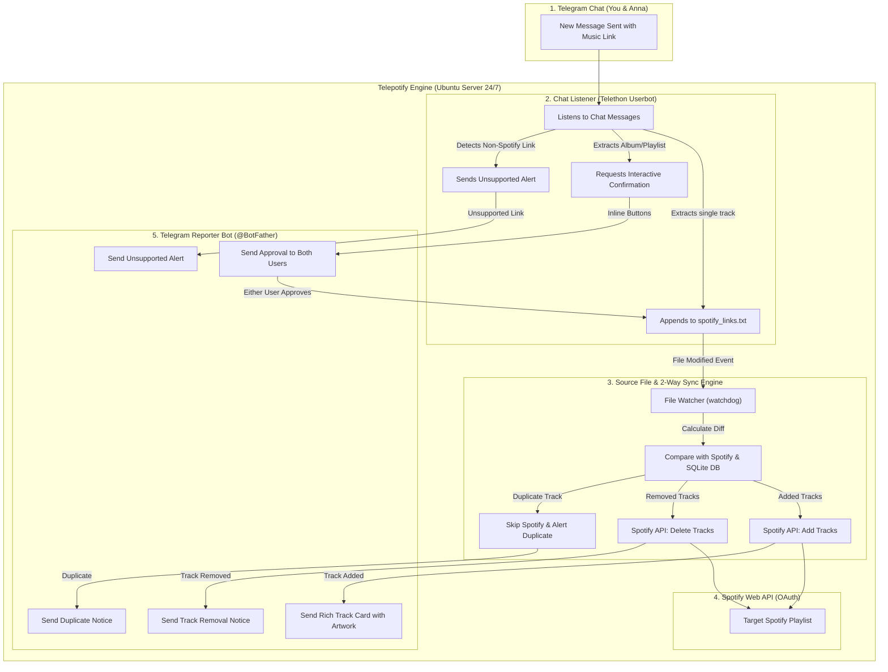

<div align="center">

# 🎧 Telepotify

**Automated 2-Way Telegram-to-Spotify Playlist Synchronizer & Interactive Bot**

[](https://www.python.org/downloads/)
[](https://opensource.org/licenses/MIT)
[](https://ubuntu.com/)

</div>

---

## 🌟 Overview

**Telepotify** is a 24/7 background service for Ubuntu/Linux servers that bridges your private Telegram conversations and your Spotify playlists.

Whenever you or your partner/friend share a Spotify track link in your Telegram chat, **Telepotify** automatically:
1. Catches the link in real time via a Telethon userbot.
2. Appends it to a 2-way synced source file (`spotify_links.txt`).
3. Syncs the song directly to your target Spotify playlist via the Spotify Web API.
4. Dispatches rich notification cards (Title, Artist, Album Artwork, Playlist Count) to both users via a dedicated Telegram Reporter Bot.
5. Sends interactive approval prompts (`[✅ Add All]` / `[❌ Dismiss]`) when Albums or Playlists are shared.

---

## 🏗️ Architecture



---

## 🚀 Key Features

- **⚡ Real-Time Chat Listener**: Telethon userbot quietly listens to your target chat for song links sent by either participant.
- **🔄 True 2-Way File Synchronization**: 
  - Adding links to `spotify_links.txt` adds songs to Spotify.
  - Deleting lines from `spotify_links.txt` automatically removes them from your Spotify playlist.
- **🤖 Interactive Dual-User Approval**: When someone sends an album/playlist link, both users receive an interactive Telegram card with inline buttons. Either user can click to approve, updating both cards in real time.
- **🖼️ Rich Notification Cards**: Sends beautiful photo cards with track title, artist, album cover, and current playlist track count.
- **🛡️ Deduplication & State Management**: Built-in SQLite database prevents duplicate additions and preserves playlist history.
- **🖥️ Headless OAuth**: Fully supports headless Linux servers (copy-paste auth URL once).
- **⚙️ Systemd Daemon Ready**: Includes an auto-installer for running 24/7 as an Ubuntu `systemd` background service with auto-restart on boot and crash recovery.

---

## 📂 Repository Structure

```text
telepotify/
├── .env.example             # Documented configuration template
├── .gitignore               # Ignores secrets, tokens, DBs, and virtualenvs
├── LICENSE                  # MIT License
├── README.md                # Documentation & Setup guide
├── main.py                  # Master async orchestrator
├── telegram_listener.py     # Telethon chat listener
├── telegram_reporter.py     # Telegram Bot API reporter & approval handler
├── file_watcher.py          # Watchdog 2-way sync file monitor
├── spotify_client.py        # Spotify Web API client & headless OAuth manager
├── state_db.py              # SQLite database manager for history & diff tracking
├── requirements.txt         # Python dependencies
├── spotify-sync.service.template # Systemd service unit template
├── setup_systemd.sh         # Helper installer for Ubuntu systemd
└── spotify_links.txt        # Master 2-way sync source file
```

---

## 🛠️ Installation & Setup (Ubuntu Server)

### 1. Clone the Repository
```bash
git clone https://github.com/yourusername/telepotify.git
cd telepotify
```

### 2. Create Virtual Environment
```bash
python3 -m venv venv
source venv/bin/activate
pip install --upgrade pip
pip install -r requirements.txt
```

### 3. Configure `.env`
```bash
cp .env.example .env
nano .env
```

Fill in your configuration:
- **`TELEGRAM_API_ID` & `TELEGRAM_API_HASH`**: From [my.telegram.org](https://my.telegram.org)
- **`TELEGRAM_PHONE`**: Your phone number for the userbot account (e.g. `+1234567890`)
- **`TELEGRAM_TARGET_CHAT`**: The chat ID or username of your private chat
- **`TELEGRAM_BOT_TOKEN`**: From `@BotFather`
- **`TELEGRAM_NOTIFY_CHAT_IDS`**: Comma-separated user IDs of recipients (e.g. `12345678,87654321`)
- **`SPOTIFY_CLIENT_ID`, `SPOTIFY_CLIENT_SECRET`, `SPOTIFY_PLAYLIST_ID`**: From [developer.spotify.com/dashboard](https://developer.spotify.com/dashboard)

> **Note:** Both you and your partner must open your new bot in Telegram and click `/start` once so the bot is permitted to DM you.

### 4. One-Time Interactive Authentication
Run the service once in terminal to authenticate:
```bash
python main.py
```
1. **Telegram**: Enter the SMS/Telegram login code sent to your account.
2. **Spotify**: Open the printed Spotify OAuth link in your browser, click **Agree**, and paste the redirect URL back into terminal.

Once you see `[READY] Automated Spotify Sync Service is fully operational 24/7!`, press `Ctrl+C`.

### 5. Enable 24/7 Background Daemon (`systemd`)
```bash
chmod +x setup_systemd.sh
./setup_systemd.sh
sudo systemctl start spotify-sync
```

Check live logs anytime:
```bash
journalctl -u spotify-sync -f
```

---

## 📄 License

This project is licensed under the MIT License - see the [LICENSE](LICENSE) file for details.
